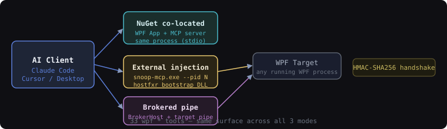

# Snoop — WPF Inspection Engine for AI Coding Agents

Inspect, mutate, and drive any live WPF application from an AI coding agent via 33 typed MCP tools.
This is [InitialForce](https://github.com/InitialForce)'s fork of [snoopwpf/snoopwpf](https://github.com/snoopwpf/snoopwpf): the Snoop desktop UI is preserved unchanged, and the same inspection engine is now also exposed as a Model Context Protocol server so Claude Code, Cursor, and Claude Desktop can observe and interact with a running WPF process.

> **Measured capability:** `wpf_resolve_binding` returns the full Source → Path → Converter → current Value chain in one call — information that UI Automation and FlaUI cannot surface because they only see the rendered string. (see [docs/recipes.md](docs/recipes.md) Recipe 1 for the end-to-end workflow)

[](https://ci.appveyor.com/project/batzen/snoopwpf/branch/master)
[](https://github.com/InitialForce/snoopwpf/actions/workflows/agent-ci.yml)
[](https://github.com/orgs/InitialForce/packages)
[](https://modelcontextprotocol.io/)

---

## Three deployment modes at a glance



---

## Choose your mode

| | NuGet co-located | External injection | Brokered pipe |
|---|---|---|---|
| **Who it is for** | Apps you own and can recompile | Third-party or legacy WPF apps | CI/test harnesses; hot-reload; multi-instance |
| **Prereqs** | .NET 8+; add `InitialForce.SnoopAgent` | `snoop-mcp.exe` on PATH; any .NET 6+ or .NET Framework 4.6.2 target | Both: `InitialForce.SnoopAgent` (target) + `InitialForce.SnoopAgent.BrokerHost` (broker) |
| **First command** | `SnoopAgent.StartCoLocated()` in `App.OnStartup` | `snoop-mcp.exe --pid <n>` | `SnoopAgent.StartBrokered(…)` OR `SnoopAgent.StartBrokeredServerAsync(…)` depending on pipe role (see details) |
| **Security boundary** | Process boundary (stdio) | Owner-DACL temp file + HMAC handshake | Pipe DACL (current user only) + HMAC-SHA256 |
| **Hot-reload friendly** | Yes — survives `dotnet watch` restart | No — must re-inject on restart | Yes — broker reconnects on target restart |
| **CI-friendly** | Yes — spawn app as subprocess | Requires PID discovery | Best choice for orchestrated test runs |
| **Mutation support** | Yes (.NET 8+ only) | Yes | Yes (.NET Framework 4.6.2: refused) |

---

## 30-second quickstart

<details>
<summary><strong>Quickstart — NuGet co-located (≈1 min)</strong> — apps you own (.NET 8+)</summary>

**1. Add the feed and package**

```xml
<!-- nuget.config beside your .sln -->
<configuration>
  <packageSources>
    <add key="initialforce" value="https://nuget.pkg.github.com/InitialForce/index.json" />
  </packageSources>
  <packageSourceCredentials>
    <initialforce>
      <add key="Username" value="%GITHUB_USER%" />
      <add key="ClearTextPassword" value="%GITHUB_TOKEN%" />
    </initialforce>
  </packageSourceCredentials>
</configuration>
```

```bash
dotnet add package InitialForce.SnoopAgent --version 1.0.0-rc.2 --prerelease
```

**2. Start the agent at app startup**

```csharp
// App.xaml.cs
protected override void OnStartup(StartupEventArgs e)
{
    base.OnStartup(e);
    SnoopAgent.StartCoLocated(); // Console.Out is redirected to Null; MCP runs on stdio
}
```

**3. MCP client config (Claude Code `.mcp.json`)**

```json
{
  "mcpServers": {
    "snoop-myapp": {
      "command": "dotnet",
      "args": ["run", "--project", "path/to/YourApp.csproj"]
    }
  }
}
```

**4. Verify the connection**

Call `wpf_get_session_info`. Expected response:

```json
{
  "processName": "MyApp",
  "pid": 12345,
  "dotnetVersion": "8.0.3",
  "mutationEnabled": false,
  "dispatchers": [
    {
      "id": 0,
      "threadId": 1,
      "windowNodeIds": ["0:1", "0:2"]
    }
  ],
  "capabilities": ["tree", "properties", "diagnostics", "resources", "screenshots"]
}
```

</details>

<details>
<summary><strong>Quickstart — External injection via snoop-mcp.exe (≈2 min)</strong> — any running WPF process, no source changes</summary>

**1. Download `snoop-mcp.exe`** from the [GitHub releases page](https://github.com/InitialForce/snoopwpf/releases).

**2. Find the target PID**

```powershell
Get-Process MyWpfApp
```

**3. MCP client config (Claude Desktop `%APPDATA%\Claude\claude_desktop_config.json`)**

```json
{
  "mcpServers": {
    "snoop-myapp": {
      "command": "C:\\tools\\snoop-mcp.exe",
      "args": ["--pid", "12345"]
    }
  }
}
```

To avoid updating the PID on each restart, target by window title instead:

```json
{
  "mcpServers": {
    "snoop-myapp": {
      "command": "C:\\tools\\snoop-mcp.exe",
      "args": ["--window-title", "My Application"]
    }
  }
}
```

**4. Verify the connection**

Call `wpf_get_session_info`. Expected response:

```json
{
  "processName": "MyApp",
  "pid": 12345,
  "dotnetVersion": "8.0.3",
  "mutationEnabled": false,
  "dispatchers": [
    {
      "id": 0,
      "threadId": 1,
      "windowNodeIds": ["0:1", "0:2"]
    }
  ],
  "capabilities": ["tree", "properties", "diagnostics", "resources", "screenshots"]
}
```

</details>

<details>
<summary><strong>Quickstart — Brokered warm-attach (≈5 min)</strong> — CI harnesses and hot-reload scenarios</summary>

> **Brokered mode has three sub-modes** — pick based on who opens the pipe server and how the token reaches the target:
>
> | Sub-mode | API | Pipe role | Token delivery | Use when |
> |----------|-----|-----------|----------------|----------|
> | **Broker spawns target** | `SnoopAgent.StartBrokered` | target=client, broker=server | stdin JSON `BrokerHandshakePayload` | Broker owns target lifecycle (classic Mode-1-style MCP host) |
> | **Target opens pipe; broker discovers** | `SnoopAgent.StartBrokeredServerAsync` | target=server, broker=client | Session manifest at `%LOCALAPPDATA%/InitialForce/mcp-session/` | Broker attaches to an independently-started target (warm-attach; `dotnet watch` friendly; MotionCatalyst pattern) |
> | **Legacy: target connects to broker** | `SnoopAgent.StartBrokeredClient` | target=client, broker=server | Command-line arg | Consumer migrating from early brokered API |
>
> The quickstart below uses the **warm-attach** sub-mode (`StartBrokeredServerAsync`) because it composes cleanly with `dotnet watch` and long-lived broker processes. For the spawn-target variant, see [docs/brokered-mode-integration.md](docs/brokered-mode-integration.md).

**1. Add packages**

```bash
# Target-side (WPF app under test)
dotnet add package InitialForce.SnoopAgent --version 1.0.0-rc.2 --prerelease

# Broker-side (test harness / CI orchestrator)
dotnet add package InitialForce.SnoopAgent.BrokerHost --version 1.0.0-rc.2 --prerelease
```

**2. Target-side startup**

```csharp
// App.xaml.cs
protected override async void OnStartup(StartupEventArgs e)
{
    base.OnStartup(e);

    // Brokered warm-attach: this target opens a pipe server and
    // publishes a session manifest; any broker discovers by PID.
    var settings = new BrokeredServerSettings(); // auto-generates pipe name + token
    BrokeredServerHandle handle = await SnoopAgent.StartBrokeredServerAsync(
        settings,
        CancellationToken.None);

    // handle.PipeName and handle.SessionToken — caller is responsible for manifest write;
    // SnoopWPF.Agent.Server handles the atomic write for you via BrokeredServerHandle.
}
```

**3. Broker-side startup**

```csharp
string pipeName = "myapp-" + Guid.NewGuid().ToString("N")[..8];
string tokenHex = Convert.ToHexString(RandomNumberGenerator.GetBytes(32));

var process = BrokerTargetSpawner.Spawn(
    exe: @"C:\path\to\MyApp.exe",
    args: Array.Empty<string>(),
    pipeName: pipeName,
    tokenHex: tokenHex);

await BrokerHost.Start(transport, new BrokerOptions
{
    PipeName = pipeName,
    SessionToken = tokenHex,
}, cts.Token);
```

**4. MCP client config**

```json
{
  "mcpServers": {
    "snoop-myapp": {
      "command": "C:\\path\\to\\MyBroker.exe"
    }
  }
}
```

**5. Verify the connection**

Call `wpf_get_session_info`. Expected response:

```json
{
  "processName": "MyApp",
  "pid": 12345,
  "dotnetVersion": "8.0.3",
  "mutationEnabled": true,
  "dispatchers": [
    {
      "id": 0,
      "threadId": 1,
      "windowNodeIds": ["0:1", "0:2"]
    }
  ],
  "capabilities": ["tree", "properties", "diagnostics", "resources", "screenshots"]
}
```

</details>

---

## Brokered attach: HMAC-SHA256 handshake

<details>
<summary>HMAC-SHA256 handshake sequence (brokered warm-attach)</summary>

```mermaid
sequenceDiagram
    participant T as WPF Target
    participant FS as %LOCALAPPDATA%\InitialForce\mcp-session\
    participant B as Broker

    Note over T,B: Sub-mode: StartBrokeredServerAsync (target=server, manifest-discovered).
    T->>T: SnoopAgent.StartBrokeredServerAsync() — open NamedPipeServerStream(NAME, CurrentUserOnly); generate 256-bit token
    T->>FS: write SessionManifest { pid, startTicks, pipeName, token, protocolVersion } → {pid}-{startTicks}.json
    Note over T: Target waits for connection — app runs normally
    B->>FS: ManifestReader.Read(pid) — locate + parse manifest
    B->>T: NamedPipeClientStream.Connect()
    B->>B: GetNamedPipeServerProcessId() — verify peer PID matches manifest
    T->>B: HandshakeChallenge { nonce: 16 random bytes, protocolVersion: 2 }
    B->>B: ProofHmac = HMACSHA256(key=token, data=nonce)
    B->>T: HandshakeResponse { proofHmac, protocolVersion: 2 }
    T->>T: FixedTimeEquals(expected, proofHmac) — constant-time compare
    T->>B: HandshakeAck { sessionId }
    Note over B,T: Session established — wpf_* tools now available
    Note over B,T: Pipe ACL: PipeOptions.CurrentUserOnly (single ALLOW ACE for current user SID)
```

Full diagrams for both warm-attach and spawn sub-modes, with injection bootstrap and failure paths: [docs/architecture.md](docs/architecture.md#brokered-handshake).

</details>

---

## Tool catalog

<details>
<summary><strong>Session &amp; Windows (3 tools)</strong> — verify connectivity and enumerate top-level windows</summary>

| Tool | What it does | 🔒 mutate | 🤖 automation req | 🎯 session req |
|------|-------------|:---------:|:-----------------:|:--------------:|
| `wpf_get_session_info` | Process name, PID, .NET version, dispatcher list, capability flags | — | — | — |
| `wpf_get_windows` | Top-level WPF windows with nodeId, title, type, dimensions | — | — | ✓ |
| `wpf_diagnostics` | Agent-health snapshot: transport, inspector, dispatcher queue depth. Distinct from `wpf_run_diagnostics` (visual-tree diagnostic providers) | — | — | ✓ |

Call `wpf_get_session_info` first on every new connection. The returned `windowNodeIds` are the entry points for all tree-navigation tools.

</details>

<details>
<summary><strong>Tree Inspection (5 tools)</strong> — navigate visual, logical, and automation trees</summary>

| Tool | What it does | 🔒 mutate | 🤖 automation req | 🎯 session req |
|------|-------------|:---------:|:-----------------:|:--------------:|
| `wpf_get_visual_tree` | Depth-limited tree snapshot; up to 5 000 nodes; cursor-paginated | — | — | ✓ |
| `wpf_get_children` | Paginated direct children of a node (50/page, max 200) | — | — | ✓ |
| `wpf_get_ancestors` | Ancestor chain from a node to the root; includes DataContext type | — | — | ✓ |
| `wpf_find_elements` | Search by type name, x:Name, or property conditions | — | — | ✓ |
| `wpf_inspect_element` | Rich single-element summary: bounds, DataContext type, binding-error count | — | — | ✓ |

All tree tools accept a `treeType` parameter: `"visual"` (default), `"logical"`, or `"automation"`.

</details>

<details>
<summary><strong>Properties &amp; Bindings (4 tools)</strong> — read and write dependency properties; trace binding chains</summary>

| Tool | What it does | 🔒 mutate | 🤖 automation req | 🎯 session req |
|------|-------------|:---------:|:-----------------:|:--------------:|
| `wpf_get_properties` | Paginated property list with value, source, binding status, redaction flag | — | — | ✓ |
| `wpf_set_property` | Set a DP value via hardcoded TypeConverter whitelist (not TypeDescriptor) | ✓ | — | ✓ |
| `wpf_get_binding_info` | Binding type, path, mode, converter, status for one property | — | — | ✓ |
| `wpf_resolve_binding` | Full Source → Path (per segment) → Converter → Value chain in one call | — | — | ✓ |

`wpf_set_property` requires `EnableMutation = true`. On .NET Framework 4.6.2 targets, mutations are refused (`MUTATION_DISABLED`) to protect the audit-log invariant.

`wpf_resolve_binding` is the key differentiator vs. UIA/FlaUI — it walks the binding path step by step and returns each intermediate value, including converter type names and validation errors.

</details>

<details>
<summary><strong>Diagnostics, Resources &amp; Screenshots (6 tools)</strong> — health checks, resource lookup, image capture</summary>

| Tool | What it does | 🔒 mutate | 🤖 automation req | 🎯 session req |
|------|-------------|:---------:|:-----------------:|:--------------:|
| `wpf_run_diagnostics` | Run built-in providers (BindingError, NonVirtualizedList, etc.); returns severity-sorted results | — | — | ✓ |
| `wpf_get_resources` | Resource dictionary lookup with precedence ordering; shows shadowed resources | — | — | ✓ |
| `wpf_get_triggers` | All triggers on an element: Style, ControlTemplate, DataTemplate, Element-level | — | — | ✓ |
| `wpf_get_behaviors` | Blend behaviors and actions; supports both legacy SDK and modern package | — | — | ✓ |
| `wpf_capture_screenshot` | PNG of an element or window; returns a `blobRef` key | — | — | ✓ |
| `wpf_fetch_blob` | Retrieve PNG bytes from the in-process BlobStore (60 s TTL by default) | — | — | ✓ |

Screenshot workflow: call `wpf_capture_screenshot` → receive `blobRef` → pass to `wpf_fetch_blob` → receive PNG `ImageContent`. MCP clients that understand `ImageContent` (Claude Desktop, Claude Code) render the image inline.

</details>

<details>
<summary><strong>Sync &amp; Polling (3 tools)</strong> — wait for UI state changes after mutations</summary>

| Tool | What it does | 🔒 mutate | 🤖 automation req | 🎯 session req |
|------|-------------|:---------:|:-----------------:|:--------------:|
| `wpf_pump_until_idle` | Wait until Dispatcher queue AND composition pipeline are idle (AND-gate, max 5 s) | — | — | ✓ |
| `wpf_poll_changes` | Non-blocking structural delta since a `treeVersion` baseline | — | — | ✓ |
| `wpf_wait_for_property` | Poll a property until it equals an expected value or an element disappears | — | — | ✓ |

Recommended mutation sequence: mutate → `wpf_pump_until_idle` → `wpf_poll_changes` → read updated properties.

</details>

<details>
<summary><strong>Input &amp; Interaction (12 tools)</strong> — drive buttons, text fields, lists, sliders, and more</summary>

| Tool | What it does | 🔒 mutate | 🤖 automation req | 🎯 session req |
|------|-------------|:---------:|:-----------------:|:--------------:|
| `wpf_click` | Invoke via UIA `IInvokeProvider` (L1); suggest `wpf_execute_command` when Command is bound | — | ✓ | ✓ |
| `wpf_double_click` | Double-click via UIA (L1) | — | ✓ | ✓ |
| `wpf_execute_command` | Execute bound `ICommand` directly (L0; no Win32 input) | ✓ | — | ✓ |
| `wpf_expand_collapse` | Expand or collapse via `IExpandCollapseProvider` (L1) | — | ✓ | ✓ |
| `wpf_toggle` | Flip ToggleButton state via UIA `IToggleProvider` (L1) | — | ✓ | ✓ |
| `wpf_select_item` | Select by index, exact text, or unambiguous substring in any Selector | ✓ | — | ✓ |
| `wpf_select_item_by_index` | Select by zero-based index (explicit, no ambiguity) | ✓ | — | ✓ |
| `wpf_select_item_by_scroll` | Scroll a virtualized list to realize the target item, then select it (for WPF virtualization) | ✓ | — | ✓ |
| `wpf_set_check_state` | Set CheckBox/RadioButton state deterministically (L0) | ✓ | — | ✓ |
| `wpf_set_slider_value` | Set RangeBase.Value; accepts absolute or normalized [0,1] (L0) | ✓ | — | ✓ |
| `wpf_set_text_value` | Set TextBox/PasswordBox/RichTextBox text via SetCurrentValue (L0) | ✓ | — | ✓ |
| `wpf_get_list_items` | Enumerate ComboBox/ListBox items for inspection | — | — | ✓ |

All L0 tools use `DependencyObject.SetCurrentValue` — existing TwoWay bindings and triggers remain intact; the binding chain is not cleared.

All mutation tools require `EnableMutation = true` in `SnoopAgentOptions`.

</details>

---

## Compared to the alternatives

| Feature | **This fork** | Upstream Snoop | FlaUI | raw UIA3 | WinAppDriver |
|---------|:---:|:---:|:---:|:---:|:---:|
| Binding chain inspection | ✓ full chain | ✓ UI only | — | — | — |
| DP mutation via typed API | ✓ | ✓ (manual) | — | — | — |
| Screenshot (element-level) | ✓ | ✓ | ✓ | — | ✓ |
| MCP-native (33 tools) | ✓ | — | — | — | — |
| Visual + Logical + Automation trees | ✓ | ✓ | UIA only | UIA only | UIA only |

**Upstream Snoop** — same inspection depth, no MCP surface; ideal for human-interactive debugging.
**FlaUI** — reliable UIA automation library; no binding-chain access; no MCP; good for UI test automation without AI.
**Raw UIA3** — foundation everything else sits on; only sees rendered strings, no WPF-layer data.
**WinAppDriver** — WebDriver-protocol UIA wrapper; works for cross-framework tests; no binding depth.

See [docs/comparison.md](docs/comparison.md) for the full 8-tool comparison matrix, covering Upstream Snoop, FlaUI, Raw UIA3, WinAppDriver, Appium Windows Driver, Playwright, TestStack/White, and this fork.

---

## Honest weaknesses

- **Injection barrier.** `snoop-mcp.exe` cannot inject into processes protected by anti-tamper or anti-cheat mechanisms, elevated processes owned by a different user, or self-contained single-file WPF apps (same limitation as upstream Snoop).
- **WPF only.** WinForms, WinUI 3, MAUI, and UWP are not supported. The engine depends on `System.Windows.DependencyObject` and the WPF Dispatcher; there is no plan to support non-WPF frameworks.
- **Polling-based change detection.** `wpf_poll_changes` returns a structural diff on demand; it does not push events to the client. A push-event (WebSocket or SSE) transport is a future-work item tracked separately. → [docs/comparison.md](docs/comparison.md) explains push-event alternatives like FlaUI's `AddAutomationEventHandler`.

---

## Where to go next

| Goal | Document |
|------|----------|
| Understand the internal architecture | [docs/architecture.md](docs/architecture.md) |
| Full 8-way alternative comparison | [docs/comparison.md](docs/comparison.md) |
| Common task recipes (binding debug, CI smoke test, screenshot diff) | [docs/recipes.md](docs/recipes.md) |
| Security model in depth | [docs/security.md](docs/security.md) |
| NuGet consumer guide (feed setup, auth, upgrade from 6.x) | [docs/consuming-nuget.md](docs/consuming-nuget.md) |
| Machine-readable tool surface for AI consumers | [llms.txt](llms.txt) |

---

## Downstream consumer example

The [MotionCatalyst/wpf-mcp broker](https://github.com/InitialForce/wpf-mcp) is a reference downstream consumer that adds lifecycle and navigation tools on top of the 33 `wpf_*` tools: `mc_launch`, `mc_attach`, `mc_navigate_to`, and others. Those tools live in the consuming application, not in this repository.

---

## Contributing and building

Open `Snoop.sln` in Visual Studio 2022 or later. Required components:

- .NET SDK 10.0.100 or later
- C++ build tools (x86/x64; optionally ARM/ARM64) — import [.vsconfig](.vsconfig) in the VS installer

The `SnoopWPF.Agent.*` projects build independently of the Snoop GUI projects. Run `dotnet test` to execute unit and integration tests. The injection tests (`SnoopWPF.Agent.InjectionTests`) require a real WPF process and are skipped in headless CI by default.

---

## Credits and license

Snoop was created by [Pete Blois](https://github.com/peteblois) and is currently maintained upstream by [Bastian Schmidt](https://github.com/batzen) at [batzen.dev](https://batzen.dev).

This fork is maintained by [InitialForce](https://github.com/InitialForce). Non-AI bug fixes originating here will be offered back to upstream.

Code signing for upstream releases is provided by [SignPath.io](https://signpath.io?utm_source=foundation&utm_medium=github&utm_campaign=snoopwpf) and the [SignPath Foundation](https://signpath.org?utm_source=foundation&utm_medium=github&utm_campaign=snoopwpf).

License: see [License.txt](License.txt) — MS-PL, same as upstream.

[](https://gitter.im/snoopwpf/Lobby)
[](https://twitter.com/batzendev)
