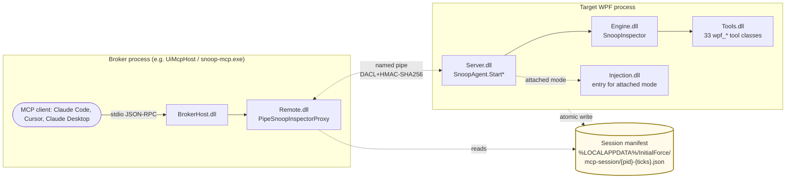
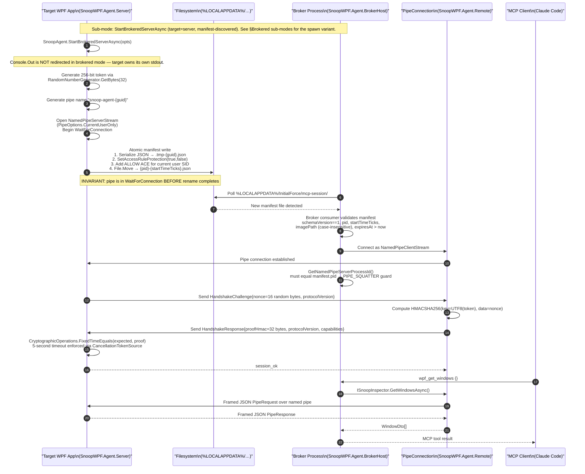
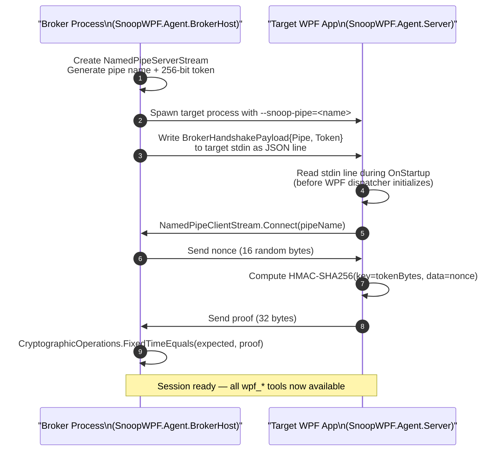
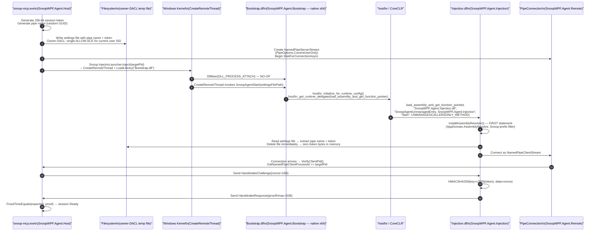
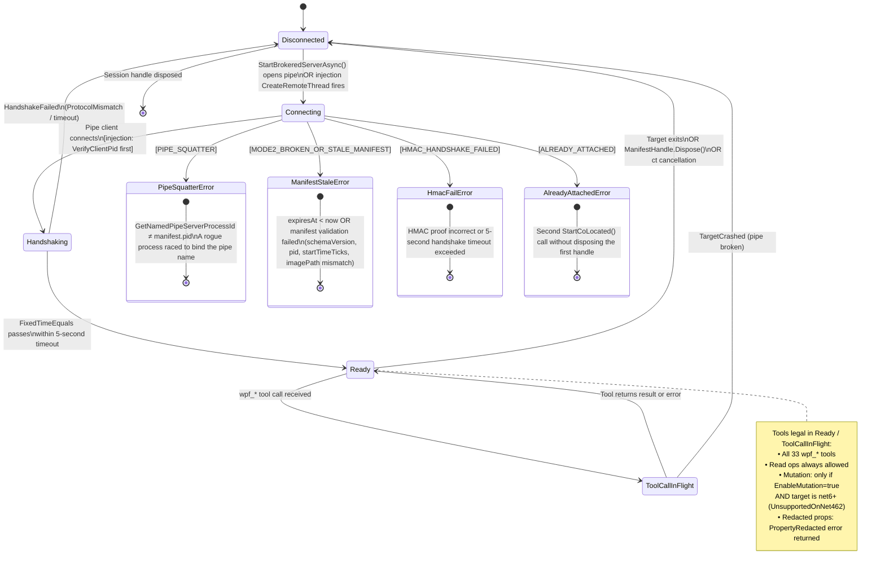

# Architecture

> Deep-dive reference for SnoopWPF.Agent. See [../README.md](../README.md) for the
> quick-start and [../llms.txt](../llms.txt) for the machine-readable capability
> summary.

---

## TL;DR

SnoopWPF.Agent splits into a **broker** (owns the MCP stdio channel, runs outside the
target) and an **agent** (runs inside the target WPF process, owns all property reads
and mutations). Three deployment modes exist: **co-located** (NuGet embedded, agent IS
the MCP server on stdio), **injection** (agent is injected via `CreateRemoteThread` +
hostfxr into an already-running process), and **brokered** (target calls
`StartBrokeredServerAsync` at startup, broker discovers it via a manifest file and
proxies all calls over a named pipe). The agent exposes 33 `wpf_*` MCP tools covering
the visual tree, properties, bindings, resources, triggers, screenshots, input
simulation, and diagnostics.

---

## Project Inventory

| # | Project | Artifact | Published | Role |
|---|---------|----------|-----------|------|
| 1 | `SnoopWPF.Agent.Bootstrap` | `SnoopWPF.Agent.Bootstrap.dll` (native x64 C++) | No | Native DLL whose `DllMain` is a no-op. Exports `SnoopAgentStart`, invoked via `CreateRemoteThread`. Uses hostfxr/nethost to load CoreCLR and call the managed injection entry point without starting a second CLR instance. |
| 2 | `SnoopWPF.Agent.Injection` | `SnoopWPF.Agent.Injection.dll` (net462/net6/net8) | No | Managed injection entry. `SnoopAgentEntryPoint.Start(settingsFile)` installs `AppDomain.AssemblyResolve` (Snoop-prefix filter), reads pipe name and token from the temp settings file, deletes the file, zeroes the token, then opens the pipe client and completes the HMAC-SHA256 handshake. |
| 3 | `SnoopWPF.Agent.Engine` | Class library (multi-targeted) | **No** (`IsPackable=false`) | Core WPF introspection engine. `SnoopInspector` is a partial class across Tree, Properties, Bindings, Resources, Triggers, Screenshots, Wait, and Input files. Owns `TypeConverterTable` (whitelist for mutation), `NodeRegistry`, and the `AuditLogWriter` (HMAC-chained JSONL, net6+ only). |
| 4 | `SnoopWPF.Agent.Server` | Published as `InitialForce.SnoopAgent` NuGet | **Yes** | Public embedding API. `SnoopAgent.StartCoLocated()` redirects `Console.Out` to `TextWriter.Null` and starts the MCP server on stdio. `SnoopAgent.StartBrokeredServerAsync()` opens a named pipe and atomically writes a session manifest. `SnoopAgent.StartBrokered()` is the spawn variant (broker creates pipe, target reads token from stdin). |
| 5 | `SnoopWPF.Agent.Tools` | Class library | **No** (`IsPackable=false`) | 33 `[McpServerTool]`-annotated classes (`wpf_*`). Each delegates to `ISnoopInspector`. Error mapping via `ToolExceptionMapper`. |
| 6 | `SnoopWPF.Agent.Contracts` | Class library | **Yes** | Shared interfaces and DTOs: `ISnoopInspector`, `ISuggestionTranslator`, `HandshakeChallenge`, `HandshakeResponse`, `BrokerHandshakePayload`, `WpfLocator`, `SessionPolicy`, `SessionMode`, `SnoopAgentOptions`, `SnoopErrorCode`. No WPF dependency. |
| 7 | `SnoopWPF.Agent.BrokerHost` | NuGet lib (broker-side) | **Yes** | `BrokerHost.Start(transport, opts, ct)` — starts a broker MCP server on an arbitrary transport and proxies all `wpf_*` calls across the named pipe to the agent. Consumed by external MCP servers (e.g. the MotionCatalyst UI host). |
| 8 | `SnoopWPF.Agent.Remote` | Class library | **Yes** | Host/broker-side pipe proxy. `PipeSnoopInspectorProxy` implements `ISnoopInspector` by serialising calls over the pipe. `PipeConnection` owns pipe ACL setup, nonce generation, and HMAC verification. `FramedJsonTransport` handles length-prefixed JSON frames. |
| 9 | `SnoopWPF.Agent.Host` | `snoop-mcp.exe` | No | MCP host for injection mode. Orchestrates injection (generates pipe name and token, writes settings file, invokes `Snoop.InjectorLauncher`), creates `PipeConnection`, then proxies MCP stdio to the injected agent. |
| 10 | `SnoopWPF.Agent.Cli` | `snoop-cli.exe` | No | Human-facing CLI over the same pipeline. Verbs: `list`, `tree`, `props`, `inspect`, `find`, `diag`, `screenshot`. |
| 11 | `SnoopWPF.Agent.Analyzers` | Roslyn analyzer NuGet | **Yes** | `SWPF0001` (Error: `Console.Write*` in an `[McpStdioEntrypoint]` type), `NodeId0010`, `PathLocator0011`. Enforced at compile time. |
| 12 | `SnoopWPF.Agent.VeriGuiHarness` | CI test harness | No | Parses scenario `.md` files, executes against a live `SnoopAgent`, and measures action-success-rate, repeat-on-unchanged-state-rate, and p95 latency. Fails CI when thresholds are breached. |

**Published NuGet packages (5):** `InitialForce.SnoopAgent` (Server), `InitialForce.SnoopAgent.Contracts`, `InitialForce.SnoopAgent.BrokerHost`, `InitialForce.SnoopAgent.Remote`, `InitialForce.SnoopAgent.Analyzers`. Engine and Tools are `IsPackable=false` — they ship only as transitive dependencies inside the Server package.

---

## Container Diagram {#container-diagram}



---

## Trust Boundaries {#trust-boundaries}

The security model is built around four nested trust domains. Everything outside the
named pipe is **untrusted**. The HMAC handshake is the single gate between untrusted
and trusted.

```mermaid
flowchart LR
    subgraph TD_MCP ["MCP Client Trust Domain"]
        direction TB
        A["MCP Client\n(LLM / Claude Code)"]
    end

    subgraph TD_Broker ["Broker Process Trust Domain"]
        direction TB
        B["BrokerHost\nSnoopWPF.Agent.BrokerHost"]
        C["PipeSnoopInspectorProxy\nSnoopWPF.Agent.Remote"]
        D["Manifest Discovery\n(broker consumer)"]
    end

    subgraph TD_Pipe ["Named-Pipe Transport\n(DACL-gated — PipeOptions.CurrentUserOnly)"]
        direction TB
        E["PipeConnection\nACL: single ALLOW ACE for current user SID"]
        F{"HMAC-SHA256\nHandshake Gate\n\nnonce=16B  proof=32B\n5s timeout\nFixedTimeEquals"}
    end

    subgraph TD_Target ["Target WPF Process Trust Domain"]
        direction TB
        G["SnoopAgent / Server\nSnoopWPF.Agent.Server"]
        H["SnoopInspector\nSnoopWPF.Agent.Engine"]
        I{"Redaction Barrier\n21-keyword suffix list\n+ SecureString / NetworkCredential\n/ DbConnectionStringBuilder\n+ [Sensitive] attribute\nGetter NEVER invoked on redacted props"}
        J["WPF Visual Tree\n(live object graph)"]
    end

    subgraph TD_FS ["Filesystem (owner-DACL ACL)"]
        K["Session Manifest\n%LOCALAPPDATA%\\InitialForce\\mcp-session\\"]
    end

    A -- "MCP stdio JSON-RPC" --> B
    B --> C
    C --> E

    D -- "validate pid + startTimeTicks\n+ imagePath + expiresAt" --> K
    D --> C

    E -- "untrusted connection" --> F
    F -- "proof matches FixedTimeEquals" --> G
    F -- "mismatch → ProtocolMismatch" --> X1["Connection rejected"]

    G --> H
    H --> I
    I -- "safe value" --> J
    I -- "[REDACTED]" --> H

    style F fill:#5b7ed8,color:#fff
    style I fill:#5b7ed8,color:#fff
    style X1 fill:#aab3c3,color:#000
    style TD_Pipe fill:#2c3e50,color:#ecf0f1
```



> **Invariant: trust is never granted without proof.** The session token is 256 bits
> from `RandomNumberGenerator`. It is delivered out-of-band (manifest file or
> settings file with owner-DACL ACL) and never echoed over the pipe in either
> direction. The HMAC proof demonstrates knowledge of the token without revealing it.

---

## Sequence Diagram: Brokered Handshake {#brokered-handshake}

### Brokered sub-modes {#brokered-sub-modes}

The brokered deployment mode has three API entry points:

| API | Who starts pipe | Token delivery | Use-case |
|-----|-----------------|----------------|----------|
| `StartBrokeredServerAsync` | Target (server) | Manifest file → broker reads | Warm-attach: target starts first, broker discovers it |
| `StartBrokered` | Broker (server) | stdin line → target reads | Spawn: broker launches the target process |
| `StartBrokeredClient` | Target (client) | Legacy — see source comments | Legacy compatibility only |

---

### Sub-mode: `StartBrokeredServerAsync` (warm-attach, target=server) {#handshake-warm-attach}

Full 15-step flow from target startup through the first successful tool call.

Note: This is the manifest-discovered warm-attach path. See the next section for the
`StartBrokered` spawn variant.



---

### Sub-mode: `StartBrokered` (spawn variant, broker=server, target=client) {#handshake-spawn}

10-step flow where the broker spawns the target process and delivers the token via stdin.



---

## Sequence Diagram: Injection Bootstrap {#injection-bootstrap}

12-step flow from `snoop-mcp.exe` invocation through a ready agent session.



---

## State Diagram: Session Lifecycle {#session-lifecycle}



---

## Token Lifecycle (brokered vs injection) {#token-lifecycle}

```mermaid
sequenceDiagram
  title Token lifecycle — brokered (warm-attach) vs injection
  participant T as Token (in memory)
  participant M as Manifest or Settings File
  participant P as Named Pipe Wire
  participant D as Destroyed

  Note over T,D: BROKERED WARM-ATTACH — token minted in TARGET
  T->>M: tokenB64 written to manifest (ACL-protected atomic rename)
  M->>T: broker reads manifest → decodes tokenB64
  Note over M: manifest lifetime: 24h lease; rotated every 6h
  T-->>P: HMAC proof only (raw token NEVER on wire)
  T->>D: token zeroed on BrokeredServerHandle.Dispose()

  Note over T,D: INJECTION — token minted in INJECTOR HOST (snoop-mcp.exe)
  T->>M: pipe+token written to temp file (owner-only DACL)
  M->>T: injected Injection.dll reads file
  M->>D: file deleted immediately after read
  T-->>P: HMAC proof only (raw token NEVER on wire)
  T->>D: token bytes zeroed via Array.Clear after HMAC computed
```

**Who mints the token:**
- **Brokered warm-attach** (`StartBrokeredServerAsync`): the TARGET mints the token inside the WPF process and writes it to the manifest. The broker is a passive reader.
- **Injection** (`snoop-mcp.exe`): the HOST process mints the token before injection and delivers it via a DACL-protected temp file.

**File lifetime difference:**
The manifest in warm-attach mode has a 24-hour expiry with 6-hour lease rotation — it persists as long as the session is alive. The injection settings file is deleted immediately after `Injection.dll` reads it (single-use, no rotation needed).

**Shared invariant:** In both modes, raw token bytes never cross the named pipe. Only the 32-byte HMAC-SHA256 proof crosses the wire. Per-connection nonces prevent replay attacks.

---

## Manifest Atomic-Write Invariant {#manifest-atomic-write}

The broker must never observe a manifest that points at a pipe that is not yet
listening. Violating this would cause a connection attempt to a non-existent pipe,
resulting in a confusing `FileNotFoundException` rather than a clean retry.

```
  Session startup sequence (enforced by StartBrokeredServerAsync)
  ──────────────────────────────────────────────────────────────

  1. Open NamedPipeServerStream (PipeOptions.CurrentUserOnly)
  2. Call WaitForConnectionAsync → pipe is NOW listening
  3. Serialize manifest JSON
  4. Write bytes → .tmp-{guid}.json   (temp file, not discoverable)
  5. ApplyProtectedAcl(.tmp-…)        (SetAccessRuleProtection + ALLOW ACE)
  6. File.Move(.tmp-…, {pid}-{ticks}.json)   ← NTFS atomic rename
                                              ← broker can now see the manifest
```

> **Invariant (R4):** `File.Move` (step 6) MUST execute after
> `WaitForConnectionAsync` (step 2) completes. The pipe server must be in a
> listening state before the manifest is visible to the broker. This is enforced
> by code ordering in `SnoopAgent.StartBrokeredServerAsync`
> (`SnoopWPF.Agent.Server/SnoopAgent.cs`) and documented in the comment header of
> `SessionManifestWriter.cs`.

Why does the ACL precede the rename? If the file were renamed first and the ACL
applied second, a racing broker on a multi-user machine could open the file in the
window between the rename and the ACL tightening, reading the session token.
Applying the ACL on the temp file means the rename is always the last observable
event and the file is always protected when it first becomes discoverable.

Implementation: `SessionManifestWriter.Write` (`SnoopWPF.Agent.Server/SessionManifestWriter.cs:50–120`)
and `SessionManifestWriter.ApplyProtectedAcl` (`…:130–152`).

---

## Manifest Schema {#manifest-schema}

Written as camelCase JSON to `%LOCALAPPDATA%\InitialForce\mcp-session\{pid}-{startTimeTicks}.json`.

| Field | Type | Description |
|-------|------|-------------|
| `schemaVersion` | `int` | Always `1`. Broker rejects any other value with `MANIFEST_SCHEMA_MISMATCH`. |
| `sessionId` | `string` (GUID) | Stable per-session identifier. Persists across lease rotations. |
| `pid` | `int` | Process ID of the WPF target at manifest-write time. |
| `startTimeTicks` | `long` | `Process.StartTime.ToUniversalTime().Ticks`. Defeats PID reuse: same PID, different process → different ticks. |
| `imagePath` | `string` | Full path to the target `.exe` (from `Process.MainModule.FileName`). Broker validates case-insensitively. |
| `imageHash` | `string` | SHA-256 hex digest (uppercase) of the bytes at `imagePath`. |
| `runtimeFamily` | `string` | `"CoreCLR"` or `"NetFramework"`. |
| `runtimeVersion` | `string` | Runtime version string (e.g. `"8.0.5"` for CoreCLR, `"4.8"` for .NET Framework). |
| `bitness` | `int` or `string` | `32`, `64`, or `"ARM64"`. |
| `integrityLevel` | `string` | Windows integrity level: `"Low"`, `"Medium"`, `"High"`, or `"System"`. |
| `pipeName` | `string` | Named-pipe name the broker must connect to (`snoop-agent-{guid}`). |
| `tokenB64` | `string` | Base64 of the UTF-8 hex session token (256-bit). Broker decodes → base64 → hex string → UTF-8 bytes for HMAC key. |
| `leaseId` | `string` (GUID) | Per-write lease identifier. Changes on 6-hour rotation. |
| `issuedAt` | `DateTimeOffset` | UTC instant the manifest was written. |
| `expiresAt` | `DateTimeOffset` | `issuedAt + 24h`. Broker rejects stale manifests. |

Manifest validation contract (for broker consumers implementing discovery):

> **Note:** `ManifestReader` (the reader side) is **not** part of snoopwpf.
> Snoopwpf ships only the **writer** side (`SnoopWPF.Agent.Server/SessionManifestWriter.cs`).
> Broker consumers implement their own discovery and validation. The reference
> implementation lives in MotionCatalyst's `UiMcpHost` at
> `Tools/ui-mcp-host/Brokered/Attach/ManifestReader.cs` in the
> [wpf-mcp repo](https://github.com/InitialForce/wpf-mcp). The 6-step contract
> below is the recommended validation sequence:

1. `schemaVersion == 1` else `MANIFEST_SCHEMA_MISMATCH`
2. `pid == targetPid`
3. `startTimeTicks == process.StartTime.ToUniversalTime().Ticks`
4. `imagePath == process.MainModule.FileName` (case-insensitive)
5. `expiresAt > DateTime.UtcNow`
6. After pipe connect: `GetNamedPipeServerProcessId() == pid` else `PIPE_SQUATTER`

---

## Handshake Protocol v2 Wire Format {#handshake-protocol}

```
  CHALLENGE (server → client)
  ┌──────────────────────────────────────────────────────┐
  │  4 bytes  │  Frame length (little-endian uint32)     │
  ├──────────────────────────────────────────────────────┤
  │  N bytes  │  JSON { "nonce": <base64-16-bytes>,      │
  │           │          "protocolVersion": <int> }      │
  └──────────────────────────────────────────────────────┘

  RESPONSE (client → server)
  ┌──────────────────────────────────────────────────────┐
  │  4 bytes  │  Frame length (little-endian uint32)     │
  ├──────────────────────────────────────────────────────┤
  │  N bytes  │  JSON { "proofHmac": <base64-32-bytes>,  │
  │           │          "protocolVersion": <int>,        │
  │           │          "agentVersion": <string>,        │
  │           │          "targetRuntime": <string>,       │
  │           │          "dispatchers": [...],            │
  │           │          "capabilities": [...] }          │
  └──────────────────────────────────────────────────────┘
```

The nonce is 16 random bytes generated fresh for every connection attempt via
`RandomNumberGenerator.GetBytes(16)`. The client computes
`HMACSHA256(key=UTF8(sessionToken), data=nonce)` and returns the 32-byte result as
`proofHmac`. The server verifies using
`CryptographicOperations.FixedTimeEquals(expectedHmac, proofHmac)` — a constant-time
comparison that eliminates timing-oracle attacks. A 5-second per-handshake timeout is
enforced via a linked `CancellationTokenSource` (`CancelAfter(HandshakeTimeoutMs)`).
The session token is never transmitted in either direction; only the HMAC proof crosses
the wire. Per-connection nonces provide replay protection: recording and replaying a
valid `HandshakeResponse` against a new connection produces a different expected HMAC
and is rejected.

Implementation: `PipeConnection.HandshakeAsync` (`SnoopWPF.Agent.Remote/PipeConnection.cs:81–155`).

---

## Three Deployment Modes {#deployment-modes}

### Mode 1: NuGet Co-located {#mode-collocated}

**Who should use this:** WPF apps that want to permanently embed a Snoop MCP surface
(CI harnesses, dev builds, acceptance test targets).

**Bootstrap steps:**

1. App references `InitialForce.SnoopAgent` NuGet package.
2. `App.OnStartup` (or equivalent) calls `SnoopAgent.StartCoLocated(options)` on the
   WPF dispatcher thread.
3. `StartCoLocated` — first statement — calls `Console.SetOut(TextWriter.Null)` so no
   stray writes corrupt the MCP framing.
4. `SessionPolicy.Create(SessionMode.CoLocated, options)` constructs an immutable
   policy.
5. `SnoopInspector` is constructed bound to `Application.Current`.
6. ModelContextProtocol server starts on stdio; `SnoopAgentHandle` returned to caller.

**Wire config:** stdio (default) or named pipe (`TransportMode.Pipe`). Pipe name and
session token auto-generated when not supplied; both exposed via `SnoopAgentHandle`
properties for caller delivery.

**Security boundary:** The agent IS the MCP server. No pipe, no broker. The MCP client
must be on the same machine (stdio). Redaction is on by default; mutation off by
default.

**Failure modes:**

- `InvalidOperationException` — called twice without disposing the first handle
  (`AlreadyAttached`).
- `InvalidOperationException` — called off the WPF dispatcher thread.
- `AuditUnwritable` — `AuditLogPath` configured but directory not writable and
  `AllowAuditFallback=false`.

---

### Mode 2: External Injection {#mode-injection}

**Who should use this:** Developers attaching Snoop to an already-running process they
do not control.

**Bootstrap steps:**

1. `snoop-mcp.exe --pid N` generates a 256-bit session token and a random pipe name.
2. Writes a settings temp file to a path with owner-DACL ACL containing the pipe name
   and token.
3. Creates `NamedPipeServerStream` (`PipeOptions.CurrentUserOnly`); begins
   `WaitForConnectionAsync`.
4. Invokes `Snoop.InjectorLauncher` → `CreateRemoteThread + LoadLibrary("Bootstrap.dll")`
   into the target.
5. Target's `DllMain` — no-op.
6. `SnoopAgentStart` exported function runs on the remote thread.
7. hostfxr `load_assembly_and_get_function_pointer` → loads `Injection.dll`.
8. `SnoopAgentUnmanagedEntry.Start` (`[UnmanagedCallersOnly]`) is called.
9. `SnoopAgentEntryPoint.Start(settingsFilePath)` — **first statement**: installs
   `AppDomain.AssemblyResolve` before any `Engine`/`Contracts`/`Snoop.Core` type is
   referenced.
10. Reads settings file → deletes file → zeroes token in memory.
11. `PipeAgentServer` connects as named-pipe client.
12. HMAC handshake (host sends nonce, agent replies with proof). Host verifies
    `GetNamedPipeClientProcessId == targetPid` before sending the challenge.

**Wire config:** Named pipe (random GUID). Settings file delivered via owner-DACL ACL
temp file (deleted after read).

**Security boundary:** PID verification before challenge (prevents a rogue local
process from racing to connect). `SessionPolicy.Create(Injection)` clamps
`EnableMutation=false` and `EnableRedaction=true` unconditionally (MF-11, S7),
regardless of what the settings file requests.

**Failure modes:**

- `INJECT_WRONG_RUNTIME` (`0xE0010001`) — hostfxr absent; target is .NET Framework
  only.
- `INJECT_NO_DELEGATE` (`0xE0010002`) — hostfxr proc lookup failed.
- `INJECT_INIT_FAILED` (`0xE0010003`) — `hostfxr_initialize_for_runtime_config` failed.
- `INJECT_LOAD_FAILED` (`0xE0010004`) — `load_assembly_and_get_function_pointer` failed.
- `ProtocolMismatch` — handshake timeout or PID mismatch.
- `UnsupportedOnNet462` — mutation requested on a .NET Framework 4.6.2 target.

---

### Mode 3: Brokered {#mode-brokered}

**Who should use this:** Applications shipping Snoop as a first-class feature alongside
a separate MCP host process (e.g. MotionCatalyst with its `UiMcpHost` broker).

**Bootstrap steps (warm-attach, `StartBrokeredServerAsync`):**

1. At app startup, `SnoopAgent.StartBrokeredServerAsync(opts)` is called.
2. A 256-bit token is generated; pipe name `snoop-agent-{guid}` is resolved.
3. `NamedPipeServerStream` (`PipeOptions.CurrentUserOnly`) is opened.
4. `WaitForConnectionAsync` begins — pipe is now listening.
5. Manifest is written atomically (see [Manifest Atomic-Write Invariant](#manifest-atomic-write)).
6. The broker process polls `%LOCALAPPDATA%\InitialForce\mcp-session\` for new manifests.
7. Broker consumer reads and validates the manifest (6-step contract listed above).
8. Broker calls `GetNamedPipeServerProcessId()` after connecting — PIPE_SQUATTER guard.
9. Target sends `HandshakeChallenge{nonce=16B}`.
10. Broker computes HMAC proof, sends `HandshakeResponse`.
11. Target verifies with `FixedTimeEquals` → session Ready.

**Wire config:** Named pipe. Token delivered via the manifest file's `tokenB64` field
(ACL-protected on disk, deleted by `ManifestHandle.Dispose()`). Manifest expiry: 24
hours. Lease rotation: 6 hours.

**Security boundary:** Both PID+startTimeTicks binding (defeating PID reuse) and
PIPE_SQUATTER verification. `BrokerHost` does NOT construct `AuditLogWriter` — audit
logging is target-only to prevent HMAC chain collision (see [Audit Log Invariant](#audit-log)).

**Failure modes:**

- `MANIFEST_SCHEMA_MISMATCH` — unknown schema version.
- `ManifestExpired` — `expiresAt < now`.
- `PIPE_SQUATTER` — server-side PID does not match manifest.
- `ProtocolMismatch` — handshake failure.

---

## Error Codes {#error-codes}

Defined in `SnoopWPF.Agent.Contracts/SnoopErrorCode.cs`.

| Code | Meaning | When emitted | Recovery | Example |
|------|---------|--------------|----------|---------|
| `NodeNotFound` | The node ID in the request does not exist in the registry | After a tree rebuild or element disposal | Re-query `wpf_get_visual_tree` to obtain fresh node IDs | Stale node ID from a previous session |
| `DispatcherBusy` | WPF dispatcher did not respond within the configured timeout | UI thread blocked or hung | Retry; if persistent, check for deadlocks | Long animation or blocking dialog |
| `OperationTimedOut` | General operation timeout (includes handshake timeout) | Handshake `5s` exceeded; tool call exceeds `TimeoutMs` | Retry after checking target responsiveness | `wpf_wait_for_property` exceeded `MaxWaitForPropertyMs` |
| `PropertyRedacted` | Property name matches a sensitive keyword or structural type | Any `wpf_*` tool reading or mutating a redacted property | Do not attempt to read; no recovery — by design | `wpf_get_properties` on a `PasswordBox.Password` property |
| `MutationDisabled` | `SetProperty` called but `EnableMutation=false` or injection mode | Injection mode (always clamped off); co-located with default opts | Set `EnableMutation=true` in `SnoopAgentOptions` when constructing co-located server | `wpf_set_property` without opt-in |
| `ProtocolMismatch` | Protocol version mismatch or HMAC proof incorrect | Handshake phase | Ensure broker and agent NuGet versions match; rotate session | Old broker against new agent |
| `UnsupportedOnNet462` | Feature requires .NET 6+ (e.g. `EnableMutation` with `AuditLogWriter`) | Injection into a .NET Framework 4.6.2 target | Use a .NET 6+ target or disable mutation | `EnableMutation=true` + net462 target |
| `AuditUnwritable` | Audit log directory not writable, `AllowAuditFallback=false` | Server startup | Set `AllowAuditFallback=true` or fix directory permissions | Read-only app directory |
| `LocatorAmbiguous` | `WpfLocator` expression matches more than one element | `wpf_find_elements` or element-targeting tools | Refine the locator to be more specific | Type-only locator matching multiple instances |
| `AgentDisposed` | Tool call received after the agent was shut down | Post-dispose tool call | Re-establish the session | Calling a tool after disposing `SnoopAgentHandle` |

---

## Redaction Rules {#redaction-rules}

Implemented in `SnoopWPF.Agent.Engine/Infrastructure/RedactionFilter.cs`.

**21-keyword suffix list** (case-insensitive contains match on property name):

`password`, `passwd`, `pwd`, `secret`, `apikey`, `connectionstring`, `connstr`,
`credential`, `privatekey`, `sharedkey`, `cookie`, `sessionkey`, `authorization`,
`authtoken`, `authkey`, `accesstoken`, `bearertoken`, `refreshtoken`, `sessiontoken`,
`sastoken`, `jwttoken`

**Structural type exclusions** (checked before the keyword list, on the runtime type of
the value — not the declared type):

- `System.Security.SecureString`
- `System.Net.NetworkCredential`
- `System.Data.Common.DbConnectionStringBuilder`
- Any type decorated with `[SensitiveAttribute]` (matched by `FullName` +
  assembly name to handle cross-load-context injection scenarios, per FX-M9)

**Why the getter is never invoked on redacted properties:** A custom property getter
can have arbitrary side effects — it might log the access, modify state, or throw. More
critically, `ToString()` on a sensitive value might format the secret into a string
suitable for logging, defeating the entire purpose of redaction. `RedactionFilter.Redact`
checks the property name and declared type before calling `ToString()`. For structural
sensitivity (`IsStructurallySensitive`), the runtime type of the value is inspected
before `ToString()` is ever called. The result is always the string `"[REDACTED]"` —
the raw value object is never serialised. This is enforced by the ordering in
`DtoProjection.ToPropertyDto` and `SnoopInspector.Properties.cs` (search for
`EnableRedaction`).

> **Invariant (MF-10):** Structural redaction fires before `ToString()`. Keyword
> redaction fires before the property getter is invoked in mutation paths. No sensitive
> value ever reaches the serialisation layer.

---

## Audit Log Invariant {#audit-log}

The `AuditLogWriter` class (`SnoopWPF.Agent.Engine/Audit/AuditLogWriter.cs`) is
compiled only for `net6+` targets (`#if NET6_0_OR_GREATER`). The class depends on
`System.Threading.Channels.Channel<T>`, `IAsyncDisposable`, and `ValueTask` — none of
which exist in the `net462` BCL.

> **Invariant (FX6-Z1):** Calling `SnoopAgent.StartCoLocated()` or the injection entry
> point with `EnableMutation=true` on a .NET Framework 4.6.2 target raises
> `SnoopException(UnsupportedOnNet462)` and aborts startup. Mutation is refused
> unconditionally on net462 because there is no audit trail without `AuditLogWriter`.
> Running a mutation session with no tamper-evident log violates the security contract
> (FX6-Z1, see `ARCHITECTURE-CHANGE-2026-04-17-Z1-NET462-MUTATION-REFUSED.md`).

The audit log structure: each entry is a JSONL line whose `hmac` field is
`HMACSHA256(entryJson || prevHmac || sessionKey || counterNonce)`. The session key is
32 random bytes generated at construction time and held only in memory. The `counter`
field (big-endian 8-byte encoding) is the authoritative nonce; any caller-supplied
`counterNonce` is ignored to prevent injection attacks. The log file is created with an
owner-only ACL on Windows (`net8+`). In brokered mode the broker must NOT construct
`AuditLogWriter`; audit logging is target-only to prevent HMAC chain corruption from
two concurrent writers (B-5, M2-21).

---

## Extension Points {#extension-points}

- **`ISuggestionTranslator`** (`SnoopWPF.Agent.Contracts/ISuggestionTranslator.cs`) —
  Translates a `FailureReason` plus call context into a machine-executable
  `SuggestionDto`. The default implementation (`DefaultSuggestionTranslator`) delegates
  to a static switch table. Consumer-side implementations can replace or decorate the
  default DI registration to remap generic broker lifecycle tool names (e.g.
  `broker_launch_target`) to product-specific tool names. Returns `null` for failure
  reasons that require operator-level intervention (e.g. `MutationDisabled`,
  `AutomationDisabled`). See
  `ARCHITECTURE-CHANGE-2026-04-16-SUGGESTION-TRANSLATOR.md` for the pluggable
  translator design.

- **`SnoopAgentOptions`** (`SnoopWPF.Agent.Contracts/SnoopAgentOptions.cs`) — The
  primary configuration surface for all three deployment modes. Key fields: `Transport`
  (`Stdio` / `Pipe`), `EnableMutation` (default `false`), `EnableRedaction` (default
  `true`, clamped to `true` in injection mode by `SessionPolicy.Create`), `MaxTier`,
  `EnableAutomation`, `AuditLogPath`, `AllowAuditFallback`, `BlobTtl`,
  `BlobStoreMaxCount`, `BlobStoreMaxBytes`, `MaxWaitForPropertyMs`, `TimeoutMs`.
  Note: `SessionPolicy.Create` enforces security ceilings regardless of what
  `SnoopAgentOptions` requests; callers cannot opt out of redaction in injection mode.
  See the `Contracts` project for the authoritative field list.
